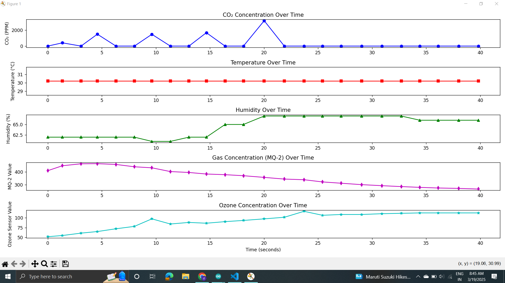

---

# **Smart Air Quality Monitoring System**  

## **Overview**  
This project is an **Air Quality Monitoring System** using **Arduino** and multiple sensors to measure various environmental parameters. The collected data is processed and visualized in **real-time using Python**.  

## **Features**  
✅ Monitors air quality parameters in real time  
✅ Uses multiple sensors for accurate readings  
✅ Displays data as live graphs using Python  
✅ Can be extended for IoT applications  

## **Hardware Components**  
- **Arduino** (Uno/Nano/ESP8266)  
- **MQ2 Gas Sensor** – Detects LPG, Smoke, Alcohol, CO  
- **MTP40 Ozone Sensor** – Measures ozone levels  
- **DHT11** – Measures temperature and humidity  
- **CO2 Sensor** – Measures carbon dioxide levels  

## **Software & Libraries**  
- **Arduino IDE** – To program the microcontroller  
- **Python** – For real-time data visualization  
- **Required Python Libraries:**  
  - `matplotlib` – For plotting graphs  
  - `serial` – For reading data from Arduino  

## **How It Works**  
1. **Arduino** reads sensor values and sends them over **serial communication**.  
2. A **Python script** captures the data and **plots real-time graphs**.  
3. The system continuously updates and displays air quality changes.  

## **Setup & Installation**  
### **1. Arduino Setup**  
- Upload the `arduino_code.ino` file to your Arduino board.  

### **2. Python Setup**  
- Install dependencies:  
  ```bash
  pip install matplotlib pyserial
  ```
- Run the script:  
  ```bash
  python air_quality_plot.py
  ```

## **Demo Screenshot**  
 

## **Future Improvements**  
🔹 Add IoT integration for remote monitoring  
🔹 Improve data accuracy with sensor calibration  
🔹 Create a web dashboard for better visualization  
